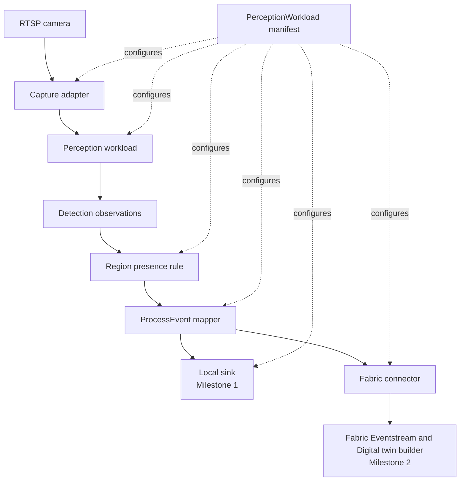
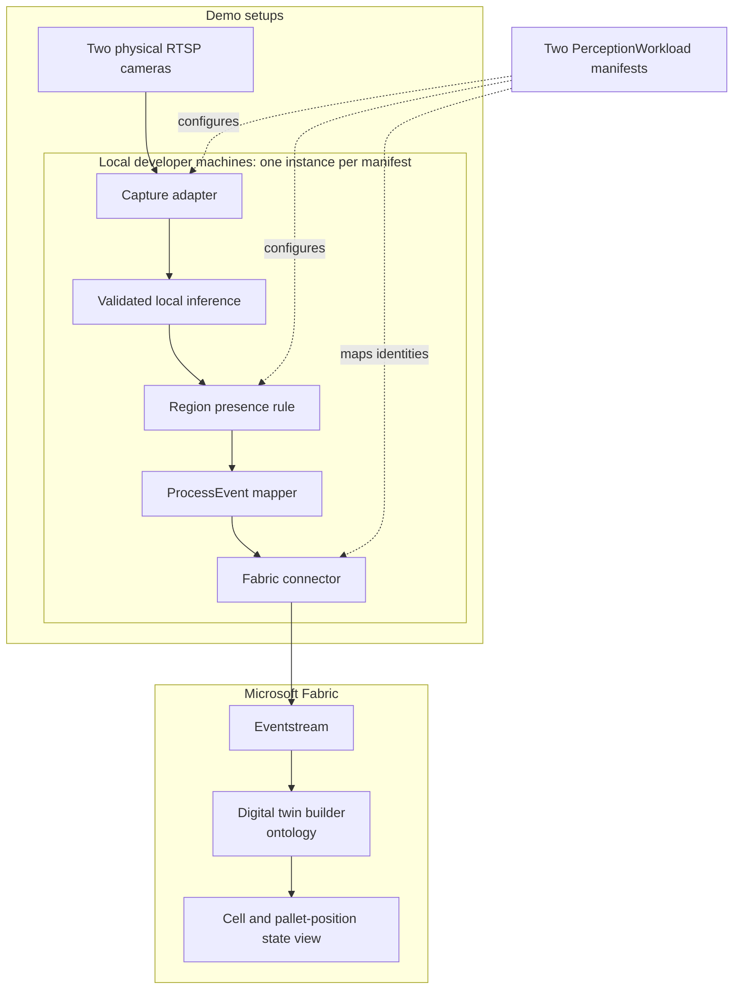

## Summary

Build a small Azure-aligned accelerator that lets a demo or evaluation team deploy the same pallet-presence application to differently arranged manufacturing cells through configuration, then publish its results into a Microsoft Fabric digital twin, built with Digital twin builder (preview) in Fabric Real-Time Intelligence.

The MVP has two validation milestones:

1. Local two-cell validation: two physical RTSP cameras, two manifests, and two concurrent application instances on one or more local developer machines, performing real inference and writing separate local event outputs. This is the scope of the [two-minute partner demo](demo-script.md).
2. Fabric digital twin representation: represent the plants, cells, and pallet positions in Fabric and update their observed occupancy from the same locally produced events through Eventstream, without changing inference or presence rules.

Fabric remains required for the complete MVP, but not for recording the first milestone. The connector keeps Fabric-specific ingestion and mapping details outside the reusable perception pipeline. Both milestones run inference on local developer machines; assume Foundry Local and Azure Local are unavailable. Foundry cloud inference is also outside the MVP requirements.

This is a planned design and a technical hypothesis, not a statement of implementation readiness or a user-validated product requirement. Optimize for learning and demonstrability over production completeness.

## User And Problem

The primary user is a demo or evaluation team preparing repeatable factory scenarios. Today, changing a camera viewpoint, model, or process rule can require rewriting the surrounding application or integration. That makes demonstrations slow to prepare and makes it difficult to reuse workloads across cells and connect their observations to a digital twin.

The MVP tests whether a stable event contract and a small set of composable adapters reduce that friction.

## Hypothesis

If a supported perception workload separates camera geometry and deployment identity from processing logic, then a team can deploy it to a second physical cell by changing a manifest rather than application code.

Milestone 1 tests this claim with independently changing pallet positions and correctly attributed local events. It demonstrates reuse for the validated viewpoints and model, not arbitrary camera angles or factory use cases.

Milestone 2 tests whether the same local event contract can populate a shared Fabric digital twin model and update the correct pallet position in each cell without changing inference or presence-rule logic. Passing milestone 1 alone does not establish this integration claim.

## MVP Scope

The local implementation and launch commands are in the
[detector runbook](../apps/detect/README.md). The
[milestone 1 validation record](milestone-1-validation.md) separates software
delivery from outstanding physical evidence. Current chair-trial manifests emit
`ObjectPresent` and do not replace the pallet acceptance criteria below.

### Milestone 1: Local two-cell validation

* One physical RTSP camera and one monitored pallet position per application instance
* Two differently arranged cells running concurrently on one or more local developer machines, with one manifest per instance
* Real inference using an existing model path validated on occupied and empty views from both cameras
* Manifest-driven camera references, monitored regions, stable source and subject IDs, and `plantName` / `plantId` metadata
* A stateful presence rule with confirmation delays and transition-event suppression
* Separate local `ProcessEvent` outputs for the two instances
* A side-by-side view of feeds, region overlays, occupancy states, and latest events, sufficient for recording
* Basic logs and documented launch commands

Prerecorded clips and deterministic fixtures support development and repeatable tests. They do not replace physical camera evidence in this milestone.

### Milestone 2: Fabric digital twin representation

* The same pallet-presence scenario and `ProcessEvent` contract
* The same validated inference path running on local developer machines
* A small ontology centered on `Plant`, `Cell`, `PalletPosition`, and `Observation`
* Entity instances and relationships representing both physical setups, with positions linked to their cells and cells to their plants
* One Fabric connector targeting one workspace and one Eventstream feeding a Digital twin builder ontology
* Configuration for entity identity, ontology mappings, and destination
* An inspectable Fabric view of both cells and their positions' last confirmed occupancy, with observation timestamps
* Evidence that independent local transitions update the corresponding Fabric position without affecting the other cell

### Out of scope

* Production-grade fleet management
* Foundry Local, Azure Local, and Foundry cloud inference deployment or runtime comparisons
* Multi-camera synchronization
* Model training or model lifecycle management
* Inventory reconciliation
* A digital-twin platform other than Microsoft Fabric
* A complete ontology for manufacturing
* High availability, autoscaling, or security certification
* Broad support for every factory use case
* A polished end-user application

## Proposed Design

```text
Physical RTSP camera (one per instance)
    |
    v
Capture adapter
    |
    v
Perception workload
(validated inference provider)
    |
    v
Detection observations
    |
    v
Region presence rule
(confirmation and transition tracking)
    |
    v
ProcessEvent mapper
    |
    v
Local sink (milestone 1)
or Fabric connector -> Eventstream -> Digital twin builder (milestone 2)
```



Each block should have a narrow interface. Implement the pipeline in one deployable process and launch it twice with independent configuration and state for milestone 1. The instances share application code, not occupancy state or output files. Multi-camera synchronization and separate services are not required.

### Capture adapter

Reads a camera stream and emits timestamped frames with source identity and availability information. Prerecorded clips are also useful for tests. Failed reads and stale frames must not be represented as successful frames containing no detections.

### Perception workload

Consumes usable frames and emits detection observations with:

* Source identity and frame capture time
* Detected class and geometry in coordinates the region rule can interpret
* `confidence`
* Provider and model identity
* An explicit indication of successful inference, including valid frames with no qualifying detections

Use real inference for the partner demo. Validate that the selected model recognizes pallets in both setups; do not assume a general object detector supports the required class. Mocks are for tests only. Provider adapters normalize outputs so the presence rule does not depend on provider-specific responses.

### Region presence rule

Maps detections inside each configured region to its stable pallet-position `subjectId`. Define the geometry matching criterion, confidence threshold, and occupied/empty confirmation windows in configuration.

Track state independently per source and subject:

* Start as unknown until usable observations confirm occupied or empty, then emit the initial confirmed boolean state
* Confirm occupied when qualifying pallet detections satisfy the occupied confirmation policy
* Confirm empty only when usable frames and successful inference show no qualifying pallet for the empty confirmation window
* After initialization, emit a `PalletPresent` event only when the confirmed boolean state changes
* On missing, stale, or unusable evidence, reset pending confirmation and show unavailable status; do not emit an empty event
* After recovery, require fresh confirmation before restoring a current state; an unchanged last confirmed value does not create another transition event

Keep availability distinct from the last confirmed occupancy value. Display stale or unavailable evidence honestly and retain confirmation delays in the recording. Restart persistence is not required for milestone 1; a restarted instance begins a new initialization sequence.

### ProcessEvent mapper

Maps confirmed presence observations to the existing [ProcessEvent schema](../apps/detect/tiger_perception/schemas/process-event-v1.json). Use `observationType: PalletPresent`, boolean `value`, and stable source and position IDs. Preserve plant metadata for attribution and later ontology mapping. Keep the vocabulary narrow; do not model the whole factory.

Illustrative confirmed occupied event, using the schema's extension support for plant metadata:

```json
{
    "schemaVersion": "1.0",
    "eventId": "cell-a-position-01-20260915T120002Z",
    "eventType": "ProcessEvent",
    "sourceId": "cell-a-camera-01",
    "subjectId": "cell-a-pallet-position-01",
    "observationType": "PalletPresent",
    "value": true,
    "unit": "boolean",
  "confidence": 0.91,
    "capturedAt": "2026-09-15T12:00:00Z",
    "producedAt": "2026-09-15T12:00:02Z",
    "publishedAt": "2026-09-15T12:00:02Z",
    "provider": "local",
    "model": "validated-pallet-model",
    "source": "rtsp",
    "plantName": "Demo Plant",
    "plantId": "demo-plant-01"
}
```

Provider and model values are illustrative; emitted events must identify the actual runtime and model. Define confidence semantics for both presence and absence before implementation; detector confidence alone is not an absence score. Camera credentials and connection endpoints must not appear in public events or the recording.

### Local sink

Writes the common event contract to a separate local output per instance. This is the required milestone 1 destination and a diagnostic or replay aid for milestone 2, not a replacement for demonstrating Fabric ingestion.

### Fabric connector

Translates the common process event into records on a Microsoft Fabric Eventstream, which feeds entity and relationship instances in a Digital twin builder (preview) ontology. This is the only component that should know Fabric-specific details such as the Eventstream endpoint, entity mapping, and workspace.

For milestone 2, the connector targets one Fabric workspace and one Eventstream. A local sink or recorded payload is useful when Eventstream is inaccessible, but cannot satisfy the Fabric success criteria.

### Fabric digital twin representation

Represent each plant, cell, and monitored pallet position with stable identity and explicit relationships. Configure the mapping from event `subjectId` to position and from position to cell and plant; do not infer identity from display names. `sourceId` retains camera provenance.

Map `PalletPresent` values to the position's last confirmed occupancy and retain observation timestamps. Relate observations to their positions so the team can inspect the evidence behind each update. Both cells use the same ontology and mapping logic with different configured identities.

The Fabric view shows last confirmed observations, not guaranteed live availability. Because unchanged occupancy produces no transition events, silence alone cannot establish camera health or empty state. Label timestamps and last confirmed values explicitly; any live availability indicator would need a separate health signal.

### Configuration

Use one human-readable `PerceptionWorkload` manifest per instance. The configuration must cover:

* `plantName` and `plantId`, plus stable camera `sourceId` and pallet-position `subjectId`
* Camera connection references resolved outside the manifest, keeping credentials and endpoints off screen
* Monitored region geometry with an explicit coordinate convention
* Inference provider and model selection
* Region matching, confidence, confirmation-window, and stale-evidence settings
* Local output path or Fabric destination reference and ontology mappings, according to milestone

The demo manifests select different cameras, regions, subject IDs, and output files while using the same application and presence-rule implementation. Plant metadata reflects the actual deployment and may be shared when both cells belong to one plant. The implemented local field layout and validation are documented in the [configuration contract](../apps/detect/README.md#configuration-contract); the Cell B pallet manifest describes local pallet presence and requires separately supplied pallet weights. Avoid a separate configuration service.

## Runtime And Deployment

Both milestones use the validated local inference path on ordinary developer machines. Assume neither Foundry Local nor Azure Local is available for the demo. Run one instance per manifest, either together on a sufficiently capable dev box or distributed across dev boxes, while retaining a side-by-side view for recording.

Milestone 1 writes separate local event outputs. Milestone 2 adds Fabric publication and digital twin representation while capture, inference, presence rules, mapping, and the connector continue running locally. Fabric access is required for milestone 2, not local inference.

Keep the inference-provider boundary for possible future Foundry or Azure Local work, but do not require implementing or comparing those runtimes to complete either milestone.

### Milestone 2 infrastructure



The diagram shows the common pipeline for both instances. Both publish to the same Fabric destination using distinct source and subject identities. Milestone 2 changes the destination and adds the twin representation, not the inference runtime.

## Demo Flow

### Milestone 1 partner recording

Follow the [two-minute script](demo-script.md) as the recording source of truth:

1. Show the two physical setups and compare their manifests without exposing connection details.
2. Launch one application instance per manifest on the local developer machines and show both feeds, overlays, and initially confirmed empty positions.
3. Place a pallet in Cell A and show its confirmed occupied event while Cell B remains empty.
4. Place a pallet in Cell B, then remove the pallet from Cell A, showing independent transitions and correct event attribution.
5. Finish on both running workloads, local events, and manifests, with no application-code edits between launches.

Fabric and inventory reconciliation are excluded from this recording. Two minutes is the video length, not an installation, startup, or confirmation-latency claim. Rehearse first, retain evidence of confirmation delays, and label time cuts.

### Milestone 2 integration walkthrough

1. Show the Fabric plant, cell, and pallet-position entities and their relationships for both physical setups.
2. Run the same two locally hosted camera workloads with Fabric publication configured, without changing inference or presence-rule logic.
3. Place a pallet in Cell A and trace its confirmed local event to the correct Fabric position update while Cell B stays unchanged.
4. Place a pallet in Cell B, then remove the pallet from Cell A, verifying the independent updates in the digital twin view.
5. Inspect event identity, observation timestamps, last confirmed values, and measured event-to-view latency. Show that loss of camera evidence does not turn a position into confirmed empty.

## Success Criteria

### Milestone 1 acceptance

* Two instances run concurrently from documented commands and separate manifests, using real inference from physical cameras
* Region overlays match the respective manifests and camera viewpoints
* Occupied and empty transitions are independently confirmed for both cells and produce schema-valid `ProcessEvent` records with `PalletPresent`, boolean values, and correct source, subject, and plant attribution
* Repeated unchanged observations produce no repeated transition events
* Missing or unusable evidence is shown as unavailable and never produces a confirmed empty event
* The second deployment requires no application-code edits
* A new team member can reproduce the setup and recording from repository documentation

### Milestone 2 acceptance

* Milestone 1 is complete
* Fabric represents both cells and their pallet positions with correct plant and cell relationships
* Both workloads continue performing inference on local developer machines without Foundry or Azure Local dependencies
* The existing `ProcessEvent` contract updates the correct position entities without changes to inference or presence-rule logic
* Both cell configurations retain correct attribution through Fabric ingestion
* Independent occupied and empty transitions are visible in Fabric with last confirmed values and observation timestamps, without cross-cell updates
* Missing evidence does not produce an empty update or a misleading live-status claim
* Validation records include event-to-view latency, identity mapping, and ingestion failures

The complete MVP requires both milestones. Record setup and adaptation time during validation rather than treating untested time estimates as acceptance criteria.

## Validation Plan

For milestone 1, run an internal rehearsal before the partner recording. Ask a demo preparer to launch both instances, check region placement, and exercise occupied and empty states independently. Test brief detection flicker, unchanged observations, camera loss, and recovery as well as the scripted sequence. Verify event timestamps, confirmation delays, attribution, and separate output files.

For milestone 2, ask the preparer to inspect the plant and cell relationships, connect the local workloads to Fabric, and repeat the physical scenario. Trace events from each local instance to its position entity and visible state. Record configuration changes, event-to-view latency, and ingestion failures. Use recorded events for repeatable connector tests, not as a substitute for the end-to-end physical demonstration.

At both milestones, measure setup time and changes required, and ask which components the team expects to reuse. Application-code edits needed for the second cell weaken the first hypothesis; cell-specific connector code or changes to inference logic needed for Fabric publication weaken the second.

## Risks And Decisions

* Camera viewpoint, lighting, and occlusion can prevent reliable pallet detection. Validate both occupied and empty views before promising the recording; configuration alone cannot compensate for an unsuitable model.
* Concurrent inference may exceed a dev box's compute budget. Validate the chosen placement across local developer machines with both workloads running and verify frame freshness and confirmation behavior.
* Camera loss and inference failures are not evidence of absence. Keep availability separate from occupancy and test recovery explicitly.
* Incorrect entity mappings can apply an observation to the wrong position. Verify stable IDs and plant/cell relationships for both event streams before the Fabric walkthrough.
* Digital twin builder is in preview. Confirm current capacity, tenant, and ontology-mapping constraints before committing to the milestone 2 timeline.
* Keep the ontology limited to plant, cell, position, and observation. Pallet identity and inventory reconciliation are not part of presence detection.
* The concept currently comes from a technical hypothesis rather than direct user research. Do not interpret the success criteria as proof of customer demand.

## Implementation Sequence

1. Confirm the existing `ProcessEvent` contract and specify normalized detections, presence confidence, and availability semantics with fixtures.
2. Validate an existing pallet-capable model on occupied and empty views from both physical cameras.
3. Add manifest-driven camera capture, region matching, and stateful presence confirmation with transition tests.
4. Connect the event mapper and separate local sinks; prepare two manifests and the side-by-side status view.
5. Test concurrent operation, camera loss, and recovery; document launches, rehearse, and record milestone 1.
6. Define the Fabric plant, cell, position, and observation entities, their relationships, and event-to-position mappings.
7. Add Fabric Eventstream ingestion and an inspectable twin state view; verify both cell identities using the unchanged local inference path.
8. Run the milestone 2 end-to-end walkthrough and record update latency, attribution, and failures before expanding scope.

## Open Questions

* Which existing pallet-capable model works reliably for both camera viewpoints, and what compute budget do two concurrent instances require?
* Which region-matching criterion, confidence semantics, confirmation windows, and stale-evidence timeout should be validated for the two setups?
* Which minimal viewer will show both feeds, configured regions, availability, confirmed states, and latest events for recording?
* Which Fabric view and entity properties best expose both cells' last confirmed occupancy and observation timestamps?
* Which Fabric workspace, capacity, and tenant settings will host the Digital twin builder item for milestone 2?
* What evidence would justify expanding from one scenario to multiple dark-factory use cases?
