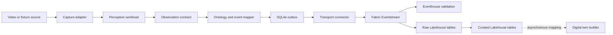

## Summary

Build a small Azure-aligned accelerator that lets a demo or evaluation team assemble
one factory video workload from reusable perception components and publish canonical
process events to Microsoft Fabric.

The MVP focuses on one line-monitoring scenario. The same workload runs with local
inference on Foundry Local on Azure Local and with cloud inference through Foundry.
The event schema, mapper, outbox, and transport connector stay stable across modes.

This is a technical hypothesis, not a user-validated production requirement. The
MVP optimizes for learning, repeatability, and inspectable evidence.

## User And Problem

The primary user is a demo or evaluation team preparing repeatable factory scenarios. Today, changing a model, camera input, or process rule can require rewriting the surrounding integration. That makes demonstrations slow to prepare and makes it difficult to compare edge and cloud execution.

The MVP tests whether a stable event contract and a small set of composable adapters reduce that friction.

## Hypothesis

If perception workloads expose a common, ontology-aware event contract, then a team
can swap the capture adapter, inference provider, or process rule without changing
the transport integration.

The hypothesis is supported when edge and cloud modes produce the same canonical
payload shape through the same connector implementation.

## MVP Scope

### In scope

* One camera or prerecorded video source
* One line or process-monitoring scenario
* A replaceable perception step that produces observations
* A small ontology for the selected scenario, such as `Line`, `Station`, `Product`, `ProcessState`, and `Observation`
* A rule or mapping step that turns observations into process events
* Two inference modes: Foundry Local on Azure Local and Foundry in the cloud
* One transport connector to Fabric Eventstream, with an offline JSONL substitute
* A simple configuration file for selecting the source, inference mode, ontology mappings, and destination
* Basic logs and a repeatable demo path

### Out of scope

* Production-grade fleet management
* Multi-camera synchronization
* Model training or model lifecycle management
* A new digital-twin platform
* A complete ontology for manufacturing
* High availability, autoscaling, or security certification
* Broad support for every factory use case
* A polished end-user application

## Proposed Design



Each block has a narrow interface. Eventstream fans accepted events to Eventhouse and
Lakehouse. Digital twin builder consumes curated Lakehouse mappings asynchronously;
it is not a direct Eventstream destination or a synchronous twin update API.

### Capture adapter

Reads a camera stream or prerecorded clip and emits timestamped frames. The adapter hides the input details from the perception workload.

### Perception workload

Consumes frames and emits observations. An observation should include at least:

* `subjectId`
* `observationType`
* `value`
* `timestamp`
* `confidence`
* `source`

The workload may use a simple existing model or mocked inference for the first demonstration. The interface matters more than model sophistication.

### Ontology and event mapper

Maps observations to a small, scenario-specific vocabulary and emits process events. Keep the ontology narrow enough to understand and inspect during a demo. Do not attempt to model the whole factory.

Example event:

```json
{
  "eventType": "ProcessStateChanged",
  "subjectId": "station-01",
  "state": "blocked",
  "timestamp": "2026-08-18T12:00:00Z",
  "confidence": 0.91,
  "source": "foundry-local"
}
```

### Transport connector

Publishes the canonical process event without changing its schema. The implemented
Python protocol retains the historical `TwinConnector` name, but its responsibility
is transport only. It does not create twins, mutate a graph, manage devices, or know
Fabric workspace and mapping identifiers.

The local JSONL connector and Fabric Eventstream connector implement the same
boundary. The Eventstream connector uses the Event Hubs-compatible SDK and partitions
by `subjectId`.

### Durable delivery boundary

The edge process commits mapper state and its canonical event atomically to a bounded
SQLite outbox before network publication. A remote acknowledgement removes the event.
Fabric retention starts only after acceptance and cannot recover events generated
during a disconnected site outage.

Fabric is not a device registry or an edge queue. It does not provide device
enrollment, per-device revocation, certificate issuance, or command delivery. Those
requirements trigger the production components described in
[Production Evolution](production-evolution.md).

### Fabric analytics and twin projection

Eventhouse provides immediate count, duplicate, sequence, and publisher latency
checks. Lakehouse stores raw events and curated, duplicate-safe station history and
current state. Digital twin builder maps the curated tables after those checks pass.

Digital twin builder is a preview analytical projection. It is non-authoritative and
must not control equipment, own operational state, or receive direct edge writes.
Generated base tables are platform-owned; consumers use generated domain views.

### Configuration

Use one human-readable configuration file to select the runtime and mappings:

```yaml
source: sample-line-video
inference: foundry-local
ontology: line-monitoring-v1
destination: existing-twin
```

The repository uses strict YAML manifests. Secrets remain in environment variables;
configuration stores variable names only. The offline manifest selects
`local-jsonl`, while the live manifest selects `fabric-eventstream`.

## Runtime Modes

The same pipeline and event contract should support two modes:

* Edge mode runs inference through Foundry Local on Azure Local and publishes events from the local environment.
* Cloud mode runs inference through Foundry and publishes events through the same mapper and connector boundary.

The MVP does not need identical model outputs in both modes. It does need comparable event shapes and an explicit indication of which runtime produced each observation.

## Demo Flow

1. Start the pipeline against a prerecorded line-monitoring clip.
2. Select edge inference in the configuration.
3. Show observations and mapped process events.
4. Verify that the local JSONL sink receives the canonical event.
5. Change the inference mode or swap one perception component.
6. Run the same fixture again without changing the connector.
7. Compare payload keys and value types while allowing runtime metadata and
    model-derived values to differ.
8. When all tenant prerequisites pass, publish one uniquely identified live event
    and verify Eventhouse, Lakehouse, and asynchronous twin evidence separately.

## Success Criteria

The MVP is successful when all of the following are true:

* The team can run one line-monitoring scenario from a documented command or script.
* The edge and cloud modes produce the same event contract.
* The transport connector is unchanged when the inference mode is changed.
* A second scenario variation can be created by changing configuration or replacing one component, without rewriting the connector.
* A new team member can understand and run the demo from the repository documentation.
* The team records enough timing and output information to compare the two runtime modes.

Suggested initial targets:

* Assemble the first scenario in one working day after the base pipeline exists.
* Create the second variation in less than half a day.
* Keep the live demo path under five minutes from publication to a visible twin
    event after the tenant-backed path is validated.

These targets are working assumptions and should be revised after the first user walkthrough.

## Validation Plan

The first validation should be a short internal or partner walkthrough with the people who prepare factory demonstrations.

Ask them to:

* Assemble the initial scenario from the documentation.
* Change the inference mode.
* Replace or adjust one perception component.
* Explain which parts they expect to reuse for another factory scenario.

Measure setup time, changes required, failures encountered, and whether the resulting event is understandable in the twin platform. If the team still needs to edit the connector for common variations, the contract or component boundary is not yet useful.

## Risks And Decisions

* Digital twin builder availability depends on tenant, region, capacity, and preview
    approval. Offline acceptance does not prove those conditions.
* Foundry Local and Foundry may expose different model capabilities or operational constraints. Treat runtime selection as an adapter boundary and test one representative model path in each mode.
* Ontology work can expand indefinitely. Limit the first vocabulary to the selected process scenario and document what is intentionally missing.
* A fixture hides camera and network problems. Use it for repeatability, then run a
    separately evidenced live smoke test before claiming end-to-end acceptance.
* The concept currently comes from a technical hypothesis rather than direct user research. Do not interpret the success criteria as proof of customer demand.

## Implementation Sequence

1. Define the observation and process-event contracts with sample payloads.
2. Build the prerecorded-video capture adapter and a deterministic sample workload.
3. Add the ontology mapper and a local event sink.
4. Add the durable transport connector.
5. Add the edge and cloud inference adapters behind the same interface.
6. Document and rehearse the demo flow.
7. Run the validation walkthrough and record what should be changed before expanding scope.

## Open Questions

* Which process state or event is most useful for the first line-monitoring demonstration?
* Is a real model required for the first demo, or is a deterministic workload sufficient to validate composition?
* What evidence would justify expanding from one scenario to multiple dark-factory use cases?
