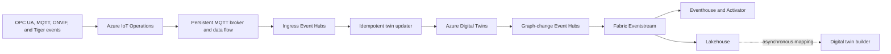

## Recommended Production Path

The production baseline uses Azure IoT Operations (AIO) at each industrial site and
Event Hubs as the durable cloud handoff. Fabric remains the analytics and semantic
projection plane. Azure Digital Twins (ADT) is added only when applications require
a live mutable graph.

The ADT branch is conditional. Without a live graph requirement, Event Hubs feeds
Fabric directly and the updater, ADT, and graph-change route are omitted.

## Source-of-Truth Boundaries

| Concern | Authority | Derived or transient stores |
|---------|-----------|-----------------------------|
| Unsent edge events and delivery state | Site outbox until cloud acknowledgement | Fabric has no record before acceptance |
| Device identity when per-device control is required | IoT Hub device registry and DPS enrollment | AIO gateway identity and Fabric workspace access |
| Immutable process-event facts | Approved retained event archive and raw Lakehouse after cloud acceptance | Eventstream retention and Eventhouse query tables |
| Curated analytical station state | Curated Lakehouse tables | Digital twin builder entities and time series |
| Live mutable graph when required | Azure Digital Twins | Fabric graph and digital twin builder projections |
| Operational equipment state without ADT | Source control system, historian, or approved operational system | Fabric analytical projections |

Preview Fabric twins never become operational authority by default. Moving authority
requires approved region, scale, support, identity automation, recovery, and SLA
evidence.

## Component Responsibilities

### Azure IoT Operations

AIO owns site protocol mediation, local MQTT persistence, data flow, and managed edge
operations on a supported Arc-enabled Kubernetes platform. Use a durable custom
gateway when the site cannot operate that platform.

### Event Hubs

Event Hubs decouples site availability from downstream analytics and gives each
consumer an independent checkpoint. Fabric receives events through a dedicated
consumer group. Event Hubs does not replace the edge outbox for events created while
the cloud path is unavailable.

### IoT Hub and DPS

Add IoT Hub and Device Provisioning Service (DPS) when each device needs cloud
identity, zero-touch enrollment, revocation, or device-specific access policy. AIO
and IoT Hub can coexist, but their responsibilities and cost must be explicit.

### Azure Digital Twins

Add an idempotent updater when a live graph, graph query, relationship mutation, or
application write API is required. The updater consumes canonical events from Event
Hubs, deduplicates by `eventId`, rejects stale per-subject sequences, and applies ADT
changes. Route accepted ADT graph changes through a separate Event Hubs path to
Fabric. The edge must not write independently to both ADT and Fabric.

### Microsoft Fabric

Fabric Eventstream performs ingestion and fan-out. Eventhouse supports immediate
validation and operational analytics. Lakehouse owns curated analytical history and
current-state projections. Digital twin builder and Fabric IQ ontology remain
replaceable semantic views over governed data.

## Decision Reversal Register

| Requirement or evidence | Decision owner | Selected component | Migration boundary and resulting change | Required validation evidence |
|-------------------------|----------------|--------------------|-----------------------------------------|------------------------------|
| An ADT deployment already exists | Enterprise architect | Azure Digital Twins | Preserve ADT authority; route graph changes to Fabric Eventstream | Model inventory, route replay, duplicate handling, and graph-to-Fabric latency |
| A subsecond mutable twin API is required | Application owner | Azure Digital Twins | Add the idempotent Event Hubs-to-ADT updater and graph-change route | API latency SLO, concurrency test, stale-sequence rejection, and recovery drill |
| Per-device revocation or zero-touch provisioning is required | Identity and IoT owners | IoT Hub and DPS | Move device identity from shared gateway credentials to per-device enrollment | Enrollment, renewal, revocation, disablement, and access-review evidence |
| A supported AIO platform already operates at the site | Site platform owner | Azure IoT Operations | Replace custom protocol adapters with AIO data flows when migration cost is acceptable | Arc support, protocol compatibility, disconnected operation, and upgrade rehearsal |
| Arc-enabled Kubernetes cannot be operated | Site platform owner | Durable custom gateway | Retain the stable event contract and publish from the bounded gateway to Event Hubs | Outage duration, disk bounds, backlog drain, patching, and support ownership |
| Cross-domain semantics and agent grounding become primary | Data governance owner | Fabric IQ ontology | Bind governed OneLake and time-series sources without changing edge events | Vocabulary governance, refresh behavior, access control, and query acceptance |
| Long lossless outages are required | Reliability owner | Expanded durable edge storage | Make capacity and drain throughput a release gate; retain connector contract | Peak-rate sizing, maximum outage replay, disk alert, overflow, and RPO approval |
| Fabric region, capacity, or preview approval is blocked | Fabric platform owner | Event Hubs landing | Continue durable cloud ingestion and defer Fabric twin projection | Event Hubs retention, consumer readiness, exportability, and blocker decision record |
| Production remains analytics-only with no graph write API | Product owner | Fabric Lakehouse projection | Omit ADT and keep operational systems authoritative | Query freshness target, mapping refresh evidence, and preview-risk acceptance |

## Production Security and Reliability Gates

Production approval requires all of the following evidence:

* Managed identity for AIO-to-cloud and gateway-to-Event Hubs connections
* Dedicated Event Hubs or IoT Hub consumer groups for Fabric
* X.509 enrollment, renewal, revocation, and managed certificate lifecycle for leaf devices
* TLS certificate validation and private networking where supported
* Queue byte and age limits, free-disk alerts, retry metrics, and an approved loss policy
* Backup and restore evidence for Lakehouse data, sanitized Fabric exports, and ADT models when present
* Tested recovery point and recovery time objectives for edge and cloud state
* Separate publisher-to-Eventhouse and Lakehouse-to-twin latency objectives
* Written approval for preview limitations and production SLA requirements

Use the [Fabric Security and Recovery Checklist](../fabric/security-checklist.md) to
assign owners and record evidence. Unverified controls remain blocked.